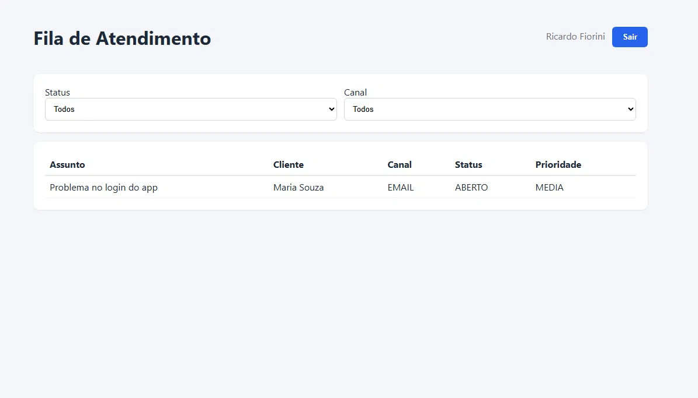
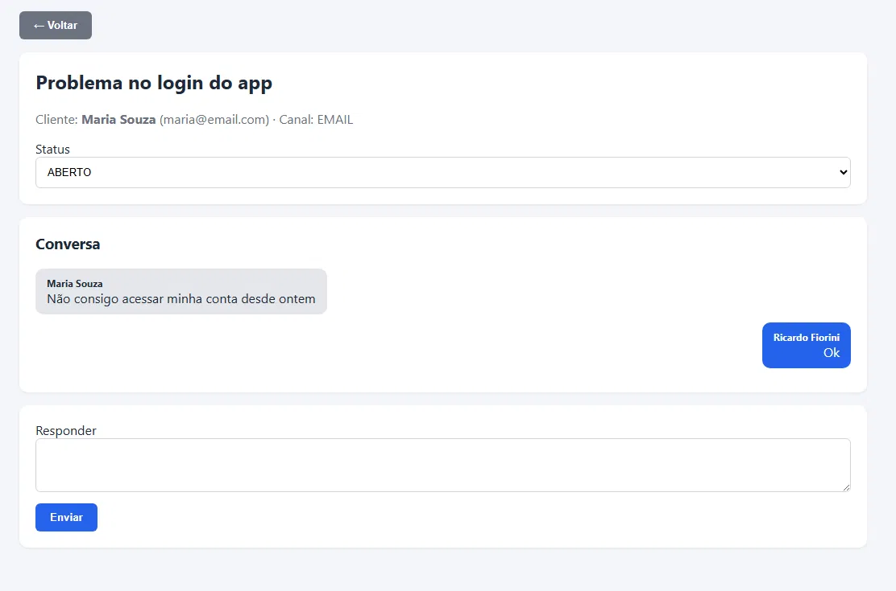

# Hub de Atendimento Unificado

Central de tickets multi-canal (e-mail, chat, formulário web, telefone) que consolida atendimentos vindos de diferentes canais numa fila única para agentes de suporte — inspirado no modelo de plataformas de comunicação unificada.

🔗 **Em produção:** [hub.ricardofiorini.com](https://hub.ricardofiorini.com)

## Screenshots

**Fila de atendimento** — lista de tickets com filtro por status e canal:



**Detalhe do ticket** — histórico de conversa e resposta do agente:



## Stack

- **Back-end**: Java 21, Spring Boot 3, Spring Security (JWT), Spring Data JPA, MySQL
- **Front-end**: Angular 18 (standalone components), TypeScript
- **Infra**: Docker (multi-stage build), deploy em VPS via systemd + Apache como proxy reverso, HTTPS via Let's Encrypt

## Arquitetura

```
┌─────────────┐      HTTPS       ┌──────────────────┐      JPA      ┌───────────┐
│   Angular   │ ───────────────► │  Spring Boot API  │ ────────────► │   MySQL   │
│  (SPA, JWT) │ ◄─────────────── │  (JWT + REST)      │ ◄──────────── │           │
└─────────────┘                  └──────────────────┘               └───────────┘
```

- Canais externos (e-mail, chat, formulário) criam tickets via endpoint público `POST /api/tickets/public` — é o que dá sentido à ideia de "hub unificado": qualquer canal pode alimentar a mesma fila.
- Agentes autenticam em `/api/auth/login` e recebem um JWT.
- Toda rota de gestão de tickets exige o JWT (`Authorization: Bearer <token>`), validado por um filtro Spring Security customizado (`JwtAuthFilter`).
- Camadas separadas: `Controller` → `Service` → `Repository`, com DTOs dedicados para requisição/resposta (nunca expõe a entidade JPA diretamente na API).

## Decisões de design

- **Criação de ticket é responsabilidade do canal externo, não do agente.** Por isso não existe um botão "novo ticket" na tela do agente — o fluxo real é o cliente (ou uma integração de e-mail/chat) abrindo o chamado, e o agente só atende.
- **Sem exclusão de tickets.** Em sistemas de atendimento reais, tickets não são apagados — eles mudam de status (`ABERTO` → `EM_ATENDIMENTO` → `RESOLVIDO`/`FECHADO`) e ficam no histórico para auditoria.
- **JWT stateless**, sem sessão no servidor — escala horizontalmente sem sticky session.

## Rodando localmente

### Backend
```bash
cd backend
# ajuste as variáveis de ambiente (DB_HOST, DB_USER, DB_PASSWORD, JWT_SECRET) ou use os defaults do application.yml

# Windows:
.\mvnw.cmd spring-boot:run

# Linux/Mac/VPS:
./mvnw spring-boot:run
```
> Não precisa ter o Maven instalado globalmente — o projeto já vem com o **Maven Wrapper** (`mvnw`/`mvnw.cmd`), que baixa o Maven sozinho na primeira execução.

Agente padrão criado automaticamente na primeira execução:
- **email**: `admin@hub.local`
- **senha**: `admin123` (trocar antes de usar em produção)

### Frontend
```bash
cd frontend
npm install
npm start
```
App sobe em `http://localhost:4200`.

### Testes
```bash
cd backend
.\mvnw.cmd test      # Windows
./mvnw test          # Linux/Mac
```

## Docker

```bash
# Backend
cd backend
docker build -t hub-backend .
docker run -p 8081:8081 --env-file .env hub-backend

# Frontend
cd frontend
docker build -t hub-frontend .
docker run -p 8080:80 hub-frontend
```

## Endpoints principais

| Método | Rota | Auth | Descrição |
|---|---|---|---|
| POST | `/api/auth/login` | - | Login do agente, retorna JWT |
| POST | `/api/tickets/public` | - | Criação de ticket vindo de canal externo |
| GET | `/api/tickets` | JWT | Lista tickets (filtros: `status`, `channel`) |
| GET | `/api/tickets/{id}` | JWT | Detalhe do ticket + mensagens |
| PUT | `/api/tickets/{id}` | JWT | Atualiza status/prioridade/agente responsável |
| POST | `/api/tickets/{id}/messages` | JWT | Agente responde no ticket |

## Deploy

Projeto rodando em uma VPS própria (Hostinger, Ubuntu 24.04), com:
- Backend como serviço `systemd` (JVM com heap limitado a 400MB para conviver com outros serviços na mesma VPS)
- Frontend servido como build estático pelo Apache
- Apache como proxy reverso para `/api` → Spring Boot (porta 8081 interna)
- Certificado HTTPS via Let's Encrypt/Certbot, renovação automática
- Banco MySQL isolado com usuário dedicado (sem uso do usuário root)

Guia completo de deploy em [`DEPLOY.md`](DEPLOY.md).

## Autor

Ricardo Fiorini — [linkedin.com/in/ricardofiorini](https://www.linkedin.com/in/ricardofiorini) · [github.com/RicardoFiorini](https://github.com/RicardoFiorini)